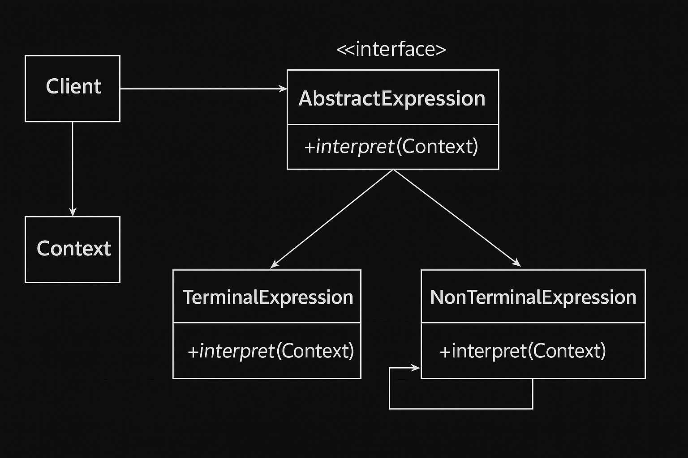

# TicTacToe
LLD Design and Code of basic Tic-Tac-Toe game

# Creation of Enum(PieceType):-
-> There are two type of Objects X and Y , with which 2 users will play...

# Creation of Playing Piece CLASS 
-> It is a class in which where piece type is defined , it is a parent class of PlayingPieceX and PlayingPieceY
   
   Variables:
   1- Type

# Creation of Playing PieceX and PlayingPieceY CLASS 
-> These classes are child classes of PlayingPiece , we can also extend other classes if more types are defined..

# BOARD Class

-> The board class is defined on which the game will be played

   Variables:-
   1- int size
   2- PlayingPiece[][] board 
   
   Methods:-
   1- getFreeCells():- It is used to check free cells in the board , where the users will place their bets...
   2- printBoard():- It is used to print the Board
   

# PLAYER Class

-> It is used to define Players in the board , in this class player is defined along with the piece type. Example:- Samiran is playing with piece X and Sid with Y respectively.....
    Variables:-

    1- String name 
    2- PlayingPiece piece

# Business Logic

-> 1- Contructor calling...
      -> The constructor is called to assign players with the types , simulataneously the board size if defined.

    2- Methods
      -> startGame():- 
      a- Starts the game with checking free spaces in the board , if no spaces are there it means all the spaces are full and curretly their are no winners in the game and it will return "tie"...
      b- If free spaces are availaible then player will put the piece in the board and then biz logic will check if the winner is decided if yes then player name is returned otherwise the loop will contine until the winner is found or otherwise it will return "tie"

# Important Java Rule
-> When we do compile , all the .java files will be converted to .class files , only those classes will be loaded to RAM by JVM which is required to be used , if the classes are not used during run-time the will not be loaded into the RAM.

-> When the classes are loaded for the first time then the static blocks inside that specific class get's executed. Post the classes get loaded into the RAM and respective static blocks are executed only then constructors get's executed.

-> Imp Note:-  If we are using new () keyword , or calls a static method , or accessing a non-static field of a class will lead to loading of classes into RAM , otherwise if we are accessing a compile-time constant (public static fnal primitive / String literal) will not lead to loading of classes into RAM/Memmory by JVM.

-> When a priority queue is created , the items are stored in default in Min-Heap , it means if the items are polled out then automatically the elements will be removed in ascending to descending order not like FIFO just in case of normal Queue.

# Interpreter Design Pattern

  -> If we have an expression to interpret with context , Example (a * b) how can we interpret this expression ?. What values can be assigned to a & b respectively,  It can be divided into 2 part.
    a- Terminanal Expression -> Elemenents which can't be divided further , like a and b.
    b- Non-terminal Expression -> Elements which can be divided further , (a*b) it can be divided into a and b respectively.

# Momento Design Pattern
   
  -> It's a behavioral pattern
  -> Provides an ability to revert the an object to a previous state i.e UNDO capability and It does not expose the object internal implementation.

  Originator:
   -> It represents the object , for which state need to be saved or restored.
   -> Expose methods to SAVE and RESTORE it's state using Momento object.

  Momento:
   -> It represents an Object which holds the state of the originator
  
  Caretaker:
   -> Manages the list of States(i.e list of Momento)

   Example:- This program helps to manage all the previous states of an object. If we want to fetch a previous state then using Momento Design Pattern it helps to fetch all the previous states.

# Visitor Design Pattern

 -> It is a Behavioural Design Pattern
 -> It allows us to add new operations to existing classes without changing their structure.
 -> It is achieved by seperating the operation from the objects on which it operates.

 Example:- 
    public class HotelRoom
    {
       public void getRoomPrice()
       {
         //price computation logic
       }
       public void initiateRoomMaintenance()
       {
         // start room maintenance
       }
       public void reserveRoom()
       {
         //perform operation to reserve room.
       }
       .........
       //many more operations can come over the time.

    }
    NOTE:- It breaks "Single Responsibility Rule" of SOLID principles as this particular class holds multiple responsibilities.

  How to approach this design problem ?
  -> Try to seperate the object in which the operations(Hotel Room) are done and the operations.

   
# Template Design Pattern (Very IMportant Pattern)

-> It's a behavioural pattern.

Why it's required and when to use ?
 -> When you want all the classes to follow the specific steps (Sequence is important) to process the task but also need to provide the flexibility that each class can have their 
    own logic in that specific steps

